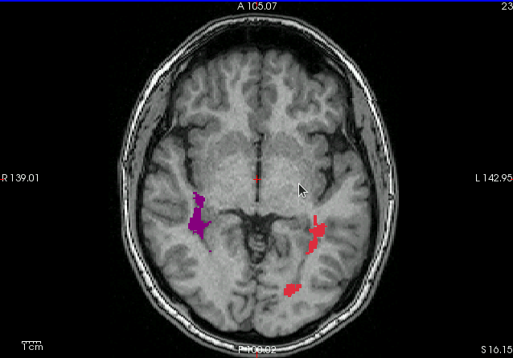

# analysis MS(multiple sclerosis) Lesion types

This project is designed to classify and analyze brain lesions caused by Multiple Sclerosis (MS) using MRI data processed through the Quantitative Susceptibility Mapping (QSM) algorithm. 
The tool adheres to Object-Oriented Programming principles and follows the SOLID design principles to ensure modularity, scalability, and maintainability.

---

## Features
- **Lesion Classification**: categorizes lesions on MRI scans to determine disease progression.
- **Hemisphere Analysis**: Counts and categorizes lesions on each hemisphere of the brain.
- **Reporting**: Generates detailed reports summarizing lesion distribution and types.

---

## Modules Overview

### `main.py`
- **Purpose**: Serves as the entry point for the application. It orchestrates the workflow by calling necessary modules for analysis and reporting.

### `data_models.py`
- **Purpose**: Defines the core data structures and classes:
  - `Subject`: Represents an MRI subject with related information.
  - `Hemisphere`: Encapsulates data and operations related to the brain's hemispheres.
  - `Lesion`: Represents individual lesions, including their type and classification.

### `report.py`
- **Purpose**: Handles the creation of reports. Provides functionality to:
  - Print summaries on the console.
  - Export results to an Excel file for further analysis.

---

## Getting Started

### Prerequisites
- Python 3.7 or higher

### Installation
1. Clone the repository:
   ```bash
   git clone https://github.com/your-username/ms-lesion-analysis.git
   cd ms-lesion-analysis
   ```

### Usage
1. Place the MRI data processed with the QSM algorithm in the required input format.
2. Run the application:
   ```bash
   python main.py
   ```
3. Follow on-screen prompts or modify `main.py` to customize execution.

---

## Output
- **Console Report**: Displays lesion counts and types per hemisphere, and a summary of lesion distributions.
- **Excel Report**: Exports lesion data into an organized Excel file.

---

## Project Principles
This project is structured around:
- **Object-Oriented Programming (OOP)**: Ensuring a clear and logical organization of code.
- **SOLID Principles**:
  - **Single Responsibility**: Each class is responsible for a specific task.
  - **Open/Closed**: Modules are open for extension but closed for modification.
  - **Liskov Substitution**: Classes can be substituted without altering functionality.
  - **Interface Segregation**: Ensures classes have only relevant methods.
  - **Dependency Inversion**: High-level modules do not depend on low-level modules but on abstractions.

---

## Contributing
Contributions are welcome! If you'd like to suggest a feature, fix a bug, or improve documentation, feel free to submit an issue or a pull request.
